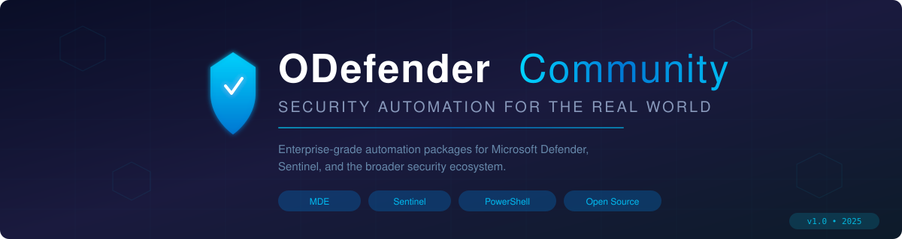

<div align="center">



<br/>

[](LICENSE)
[](https://github.com/PowerShell/PowerShell)
[](https://learn.microsoft.com/en-us/microsoft-365/security/defender-endpoint/)
[](https://azure.microsoft.com/en-us/products/microsoft-sentinel/)
[](#-join-the-mission)

<br/>

### *"Because your CISO shouldn't need to worry about tag management at 2 AM."*

<br/>

</div>

---

## 🎯 The Problem We're Solving

Let's be honest: **security maturity is expensive — not because of licenses, but because of time.**

Every enterprise running Microsoft Defender, Sentinel, or any modern security stack faces the same reality:

> *Hundreds of servers. Dozens of subscriptions. Thousands of alerts. And a team that spends more time configuring tools than actually defending the organization.*

**End-to-end protection** is the gold standard, but achieving it requires enormous administrative effort:

- 🏷️ Manually classifying and tagging servers across MDE
- 📋 Creating and maintaining Device Groups for differentiated policies
- 🔍 Tracking inactive, duplicate, and ephemeral machines
- 📊 Building reports that CISOs actually want to read
- 🔄 Repeating it all. Every. Single. Day.

**What if you could automate 90% of that work?**

That's why **ODefender Community** exists.

---

## 💡 What We Build

We create **open-source, enterprise-grade automation packages** that turn complex security operations into **zero-touch workflows**.

Every project follows the same philosophy:

| Principle | What It Means |
|-----------|---------------|
| 🔒 **End-to-End** | Complete solutions, not half-baked scripts |
| 📖 **Documented to the Bone** | Analysts LEARN while they automate |
| 🧪 **Battle-Tested** | Every package runs in real enterprise environments first |
| 🎯 **Report-First** | Always see what WOULD change before anything happens |
| 🤖 **Agent-Ready** | Designed for AI agent integration (coming soon) |
| 🌍 **Open & Inclusive** | Microsoft ecosystem + third-party integrations |

> *We don't just give you a script. We give you a complete solution with architecture diagrams, technical documentation, implementation checklists, and the confidence to deploy on Monday morning.*

---

## 📦 Projects

### 🏷️ [MDE-ServerTags](https://github.com/rfranca777/MDE-ServerTags) — `v2.2.0` ✅ Production Ready

> **Automated Server Classification for Microsoft Defender for Endpoint**

Automatically classify and tag your **entire server fleet** in MDE based on Azure subscriptions, lifecycle state, and health status. Creates the foundation for differentiated security policies per environment — with **zero daily effort**.

<table>
<tr>
<td width="50%">

**⏱️ Before (Manual)**
- 4-6 hours/week managing tags
- Error-prone manual classification
- Stale data, missed duplicates
- No lifecycle tracking
- "Who changed that tag?" — nobody knows

</td>
<td width="50%">

**⚡ After (MDE ServerTags)**
- 0 hours/week — fully automated
- Deterministic, auditable classification
- Daily sync, always current
- Lifecycle: Inactive, Ephemeral, Duplicate
- Complete CSV/HTML reports every run

</td>
</tr>
</table>

**Key Numbers**:

| Metric | Value |
|--------|-------|
| Lines of PowerShell | 8,400+ |
| Validation Stages | 10 (E2E automated test) |
| Subscription Discovery | 4-level fallback (CSV → ARM → CLI → MDE) |
| Supported Platforms | Windows Server + Linux (Ubuntu, RHEL, SUSE, Oracle, Debian) |
| Time to First Tag | ~15 minutes from clone to production |

👉 **[Get Started →](https://github.com/rfranca777/MDE-ServerTags)**

---

### ⚙️ [MDE-PolicyAutomation](https://github.com/rfranca777/MDE-PolicyAutomation) — `v1.0.4` ✅ Production Ready

> **Azure Policy + Intune Groups + MDE Device Tags — Zero-Touch Governance**

Deploy **one script** and get a complete governance stack: Azure Policy auto-tags every Windows VM, an Automation Account syncs VMs to Entra ID groups every hour, and MDE Device Groups apply differentiated AV/ASR policies per environment — with **zero portal clicking**.

<table>
<tr>
<td width="50%">

**⏱️ Before (Manual)**
- MDE portal: one big unsorted device list
- No differentiated policies per environment
- New VMs go untagged for weeks
- Intune groups manually created, always stale
- New subscription = a full day of portal work

</td>
<td width="50%">

**⚡ After (MDE PolicyAutomation)**
- MDE Device Groups per subscription — automatic
- PROD/DEV/TEST → different AV/ASR policies
- Azure Policy tags VMs at creation time
- Entra groups synced every hour via Automation
- New sub → run script → 10 min → done forever

</td>
</tr>
</table>

**Key Numbers**:

| Metric | Value |
|--------|-------|
| Deployment Stages | 14 (fully autonomous) |
| Lines of PowerShell | 1,350+ |
| Azure Resources Created | 8 (RG, AA, Group, Identity, RBAC, Runbook, Policy, Schedule) |
| Sync Frequency | Hourly (configurable) |
| Platform Support | Windows + Cloud Shell |
| Time to Full Deployment | ~10 minutes from clone to production |

👉 **[Get Started →](https://github.com/rfranca777/MDE-PolicyAutomation)**

---

### 📂 [FreeNameConvention](https://github.com/rfranca777/FreeNameConvention) — `v3.1.0` ✅ Production Ready
> **File Naming Compliance Guardian — 62 Normatives, 4 Languages, 6 Regions**

Automatically enforce international file naming standards on your Windows folders in real-time. Select from **62 normatives** spanning ISO, GDPR, LGPD, HIPAA, SOX, NF-e, and regional standards from 6 continents — with SMTP email alerts, admin password protection, and a built-in violation log. **Free forever. No cloud required.**

<table>
<tr>
<td width="50%">

**⏱️ Before (Manual)**
- Files named inconsistently across teams
- Compliance audits fail due to naming violations
- GDPR/LGPD filenames expose sensitive data classification
- Manual review of hundreds of files per audit
- Different naming rules per country, per project

</td>
<td width="50%">

**⚡ After (FreeNameConvention)**
- Real-time guardian blocks non-compliant filenames
- 62 normatives: ISO, GDPR, LGPD, HIPAA, SOX, NF-e, POPIA...
- SMTP alerts on every violation
- 4 languages: PT 🇧🇷 / EN 🇺🇸 / HE 🏳️ / ES 🇪🇸
- STRIDE-hardened: PBKDF2 admin auth, IPC allowlist

</td>
</tr>
</table>

**Key Numbers**:

| Metric | Value |
|--------|-------|
| Normatives | 62 (8 Global · 24 Americas · 10 Europe · 9 Asia-Pacific · 7 Middle East + Africa) |
| Languages | 4 (Portuguese · English · Hebrew · Spanish) |
| Token Engine | 14 tokens (date, dept, region, version, project, author, lang...) |
| Security Model | STRIDE — 6 threat categories mitigated |
| Installer Size | ~76 MB (NSIS, no dependencies) |
| Platform | Windows 10/11 · Electron 32 · Node.js ≥ 18 |
| License | MIT — free forever |

👉 **[Download Installer →](https://github.com/rfranca777/FreeNameConvention/releases/latest)**

---
### 🔮 Coming Soon

| Project | Description | ETA |
|---------|-------------|-----|
| 🤖 **MDE-ServerTags AI Agents** | Autonomous agents for machine cleanup: auto-offboard `INATIVO_40D`, investigate `DUPLICADA_EXCLUIR`, manage ephemeral fleet | Q3 2025 |
| 📊 **Sentinel-Analytics-Pack** | KQL query packs with MITRE ATT&CK mapping, PCI-DSS / NIST correlation, and auto-generated executive reports | Q3 2025 |
| 🔗 **Defender-3rd-Party-Bridge** | Integration patterns for CrowdStrike, SentinelOne, Palo Alto, and other third-party tools with Microsoft Sentinel | Q4 2025 |
| 📋 **Security-Posture-Baseline** | Automated security posture assessment against CIS Benchmarks, with remediation playbooks | Q4 2025 |
| 🛡️ **Endpoint-Hardening-Pack** | GPO/Intune templates for endpoint hardening with validation scripts and rollback support | 2026 |

---

## 🤖 The AI Agent Vision

We believe the future of security operations is **human-directed, agent-executed**.

The current version of MDE ServerTags **identifies** issues — but a human still needs to act on them. Our roadmap changes that:

```
┌──────────────────────────────────────────────────────────────────────┐
│                    TODAY                    TOMORROW                  │
│                                                                      │
│  DUPLICADA_EXCLUIR  → Manual review        → AI Agent auto-offboards │
│  INATIVO_40D        → Manual investigation → AI Agent verifies + acts│
│  EFEMERO            → Manual cleanup       → AI Agent manages fleet  │
│  Device Groups      → Manual portal work   → AI Agent creates + tunes│
│                                                                      │
│  Human Role:   Execute tasks ──────────►   Review & approve          │
│  Agent Role:   (none)        ──────────►   Execute + report          │
└──────────────────────────────────────────────────────────────────────┘
```

> *The goal: analysts spend their time on **strategic planning and threat hunting**, not on tag management and machine cleanup.*

---

## 🎯 Who Is This For?

| Role | How You Benefit |
|------|----------------|
| 🔍 **Security Analyst** | Automate the grind. Spend time on threat hunting, not portal clicking |
| 👔 **Security Manager** | Get actionable reports every morning without asking anyone |
| 🏢 **CISO** | Demonstrate measurable security maturity to the board — with data |
| 🎓 **Student / Learner** | Learn enterprise security automation with real, documented code |
| 🔧 **Consultant** | Deploy standardized, tested solutions across multiple clients |

---

## 👤 About the Author

<table>
<tr>
<td width="120" align="center">
<br/>
<strong>🛡️</strong>
<br/><br/>
</td>
<td>

**Rafael França**  
**Customer Success Architect — Cyber Security @ Microsoft**

I work at Microsoft helping enterprises unlock the full potential of the security ecosystem — from Defender for Endpoint to Sentinel, from Intune governance to end-to-end protection strategies. These projects are born from real-world challenges I see every day in the field: talented security teams spending more time configuring tools than actually defending their organizations.

**Why I share this publicly:**

I believe that **knowledge shared is defense multiplied**. Security maturity shouldn't be a privilege reserved for organizations with unlimited budgets and headcount. By open-sourcing the patterns, automations, and architectures I build with customers, I hope to raise the security baseline for everyone — from enterprise SOCs to one-person security teams.

> *"Empowering every person and every organization on the planet to achieve more."*  
> *This isn't just Microsoft's mission — it's mine. Every script published here is a step toward making end-to-end protection accessible, not just aspirational.*

[](https://www.linkedin.com/in/rfranca777/)
[](mailto:rafael.franca@live.com)

</td>
</tr>
</table>

---

## 🌍 The Bigger Picture

This initiative isn't limited to Microsoft-only shops. Our vision includes:

- **🔗 Third-party integrations** — Bridge Microsoft Defender/Sentinel with CrowdStrike, SentinelOne, Palo Alto, and other market leaders
- **📚 Knowledge democratization** — Every package includes technical explanations so analysts understand *why*, not just *how*
- **📊 Strategic output** — Final reports designed for executive consumption, enabling CISOs to make data-driven decisions
- **🌐 Multi-language** — Documentation in English and Portuguese (Brazil)

> *We want security teams to spend more time planning and less time configuring. More time investigating and less time clicking through portals. More time protecting and less time reporting.*

---

## 🤝 Join the Mission

This is an open-source community initiative. Here's how you can participate:

| Action | How |
|--------|-----|
| ⭐ **Star** | Show support by starring our projects |
| 🐛 **Report** | Found a bug? Open an issue |
| 💡 **Suggest** | Have an idea? We want to hear it |
| 🔧 **Contribute** | PRs welcome — see [CONTRIBUTING.md](CONTRIBUTING.md) |
| 📢 **Share** | Tell your SOC team, your CISO, your students |

---

## 🔒 Security

We practice what we preach. See [SECURITY.md](SECURITY.md) for our vulnerability disclosure policy.

**Repository security measures:**
- ✅ No credentials, tokens, or secrets in any codebase
- ✅ `config.example.json` templates with placeholder values only
- ✅ `.gitignore` excludes all sensitive files
- ✅ Signed commits recommended for all contributors
- ✅ Branch protection enabled on `main`
- ✅ All projects include `reportOnly` mode for safe testing

---

## 📜 License

All projects in ODefender Community are licensed under the **MIT License** — free to use, modify, and distribute.

See [LICENSE](LICENSE) for details.

---

<div align="center">

<br/>

**Built with 💙 by the security community, for the security community.**

*Because defending the world is a team sport.*

<br/>

[](#)
[](#)
[](#)

</div>
